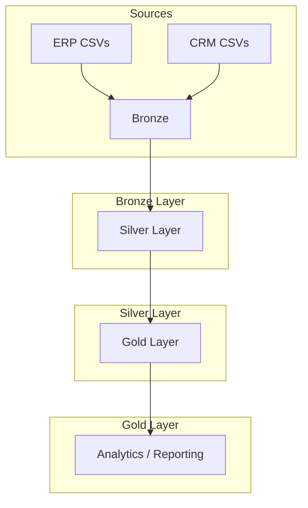

# SQL Data Warehouse Project

A modern **enterprise data warehouse** implementation using **SQL Server**. This project demonstrates a full data engineering cycle: ingesting source CSV data, cleansing and transforming it, loading it into layered tables (Bronze / Silver / Gold), and delivering analytical insights for business reporting.

---

## 📌 Project Goals

### Data Engineering (Data Warehouse)
- **Ingest** sales, customer, product, and location data from CSV files (ERP + CRM sources).
- **Cleanse & enforce quality** before analytical use.
- **Integrate** multiple sources into a single, analysis-ready dimensional model.
- **Keep it current**: focus on the latest snapshot (no full historization).
- **Document** the data model and ETL process for both business and analytics teams.

### Analytics & Reporting (Data Analysis)
Deliver SQL-based analytics to provide insights into:
- **Customer Behavior** (e.g., order frequency, top customers)
- **Product Performance** (e.g., sales by product/category)
- **Sales Trends** (e.g., month-over-month growth, seasonality)

---

## 📁 Repository Structure

```
├── datasets/                # Source CSVs (ERP + CRM)
├── scripts/                 # SQL scripts for database setup & ETL
│   ├── bronze/              # Bronze layer: raw landing tables
│   │   ├── ddl_bronze.sql
│   │   └── proc_load_bronze.sql
│   ├── silver/              # Silver layer: cleaned & conformed tables
│   │   ├── ddl_silver.sql
│   │   └── proc_load_silver.sql
│   └── gold/                # Gold layer: dimensional model / analytical tables
│       └── ddl_gold.sql
├── documents/               # Data model and pipeline diagrams
└── test/                    # Validation / data quality checks
    └── quality_check_silver.sql
```

---

## 🗂 Data Flow & Architecture

The pipeline is designed as a layered architecture (Bronze → Silver → Gold):



> **Note:** Diagrams are available in `documents/` (e.g., Data\ Model.drawio). You can open them in draw.io or diagrams.net.

---

## 🧩 Data Model (Dimensional Design)

This project uses a **star schema** approach for analytics (fact + dimensions):

- **FactSales** (sales transactions)
- **DimCustomer** (customer master data)
- **DimProduct** (product master data)
- **DimLocation** (location / store details)
- **DimDate** (date dimension, optional)

The `scripts/gold/ddl_gold.sql` script contains the full schema definition for the Gold layer.

---

## ⚙️ Setup & Deployment

### Prerequisites
- Microsoft SQL Server (any supported edition).
- SQL Server Management Studio (SSMS) or equivalent.

### Steps
1. Create a new database (example: `SalesDW`).
2. Run the layer DDL scripts in order:
   1. `scripts/bronze/ddl_bronze.sql`
   2. `scripts/silver/ddl_silver.sql`
   3. `scripts/gold/ddl_gold.sql`
3. Load data into Bronze staging tables:
   - Execute `scripts/bronze/proc_load_bronze.sql` (updates take place from `datasets/`).
4. Build Silver and Gold layers:
   - Execute `scripts/silver/proc_load_silver.sql`.

> Tip: Run each script in SSMS with `GO` separators and validate row counts after each layer.

---

## ✅ Data Quality & Validation

A sample validation script is provided under `test/quality_check_silver.sql` to verify:
- Nulls in required fields
- Key uniqueness
- Referential integrity between star schema tables

---

## 📊 Analytics & Reporting (Sample SQL)

The Gold schema is designed to support analytical queries like:

```sql
-- Top 10 products by sales amount
SELECT TOP (10)
  p.ProductName,
  SUM(f.SalesAmount) AS TotalSales
FROM dbo.FactSales f
JOIN dbo.DimProduct p ON f.ProductKey = p.ProductKey
GROUP BY p.ProductName
ORDER BY TotalSales DESC;
```

> Place additional analytic queries here (or in a separate folder) as your reporting needs grow.

---

## 🧭 Documentation & Diagrams

The following diagrams are included under `documents/`:
- **Data Model.drawio** — conceptual/physical model of the star schema
- **Data flow diagram.drawio** — ETL pipeline flow (Bronze → Silver → Gold)
- **Silver Diagram.drawio** — Silver layer transformation overview

---

## 🧪 How to Extend

To add new sources or dimensions:
1. Add the source CSV into `datasets/`.
2. Add staging tables in `scripts/bronze/ddl_bronze.sql`.
3. Update transformations in `scripts/silver/proc_load_silver.sql`.
4. Update `scripts/gold/ddl_gold.sql` for dimensional schema changes.

---

## 📌 Notes for Junior Developers

- Keep transformations (safe to run multiple times).
- Sanitize and validate all source columns before joining.
- Use surrogate keys in the Gold layer for performance and consistency.
- Document any assumptions (e.g., which source wins on conflicting records).

---

## 📬 Questions / Next Steps
If you need help adding new analytics or improving data quality rules, open an issue or update the documentation in this repository.

---

## 🤝 Connect with me


<a href="https://twitter.com/MarkAsiimwe" target="blank"></a>
<a href="https://www.linkedin.com/in/mark-asiimwe-0ab0611ab/" target="blank"></a>
<a href="https://fb.com/asiimwe mark amooti" target="blank"></a>
<a href="https://www.instagram.com/asmark_twirlings/" target="blank"></a>
<a href="https://www.youtube.com/channel/UCQ_kIWCzWff9SeLaerzjzwg" target="blank"></a>
</p>


